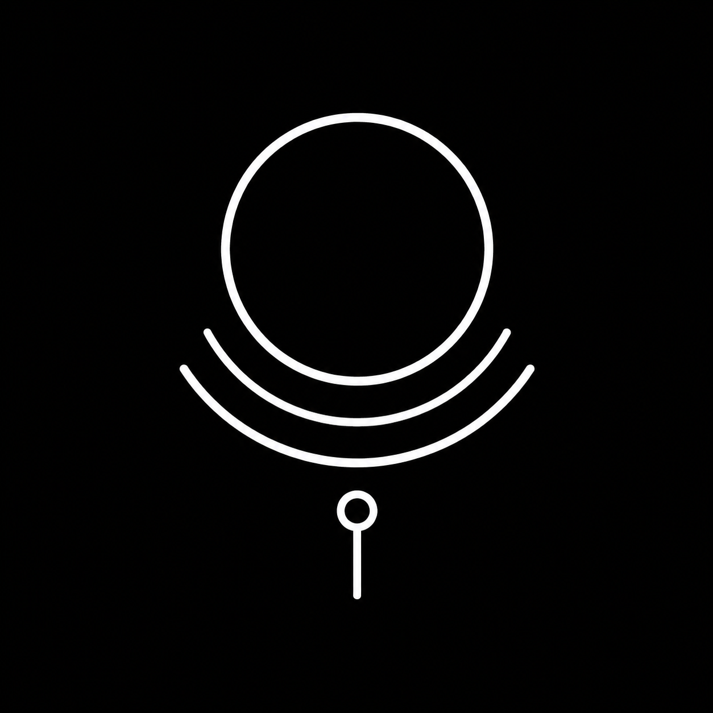
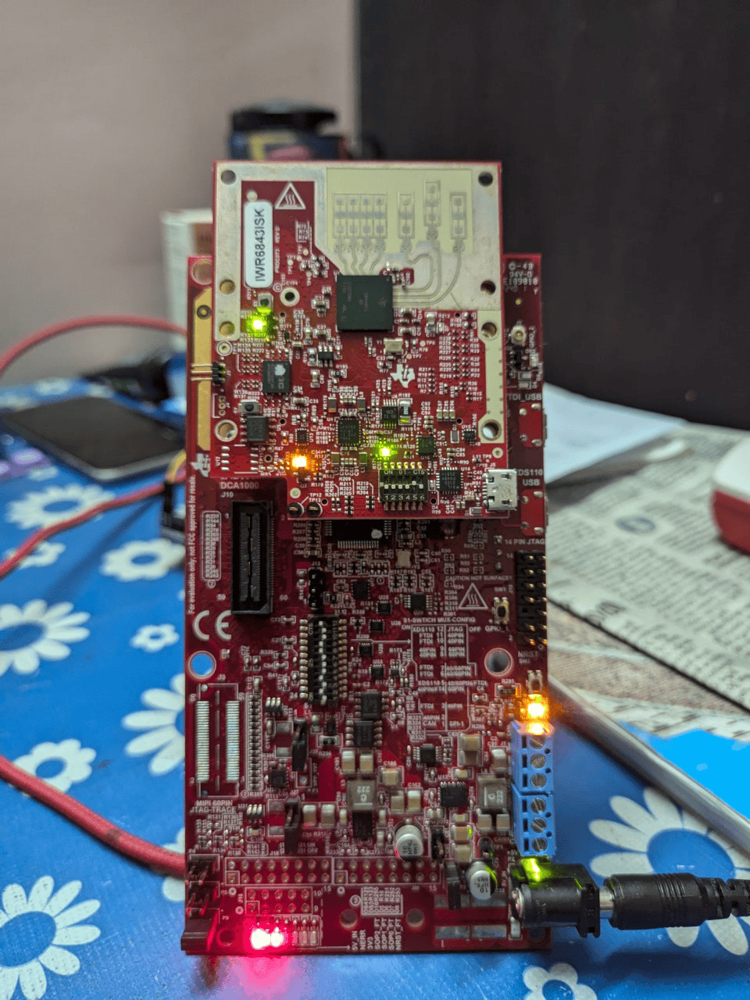
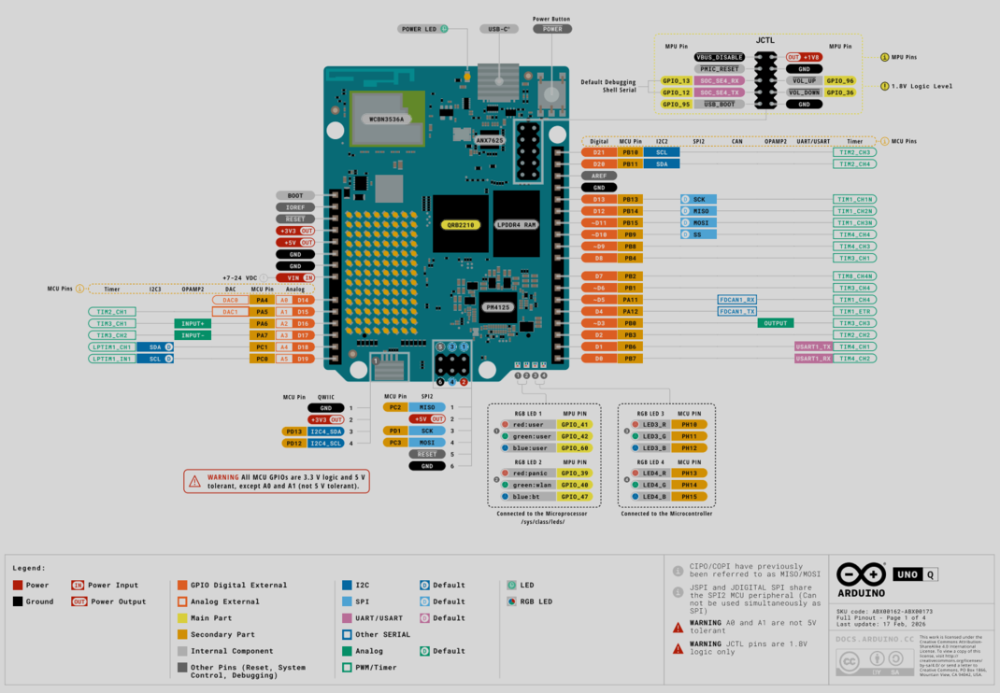
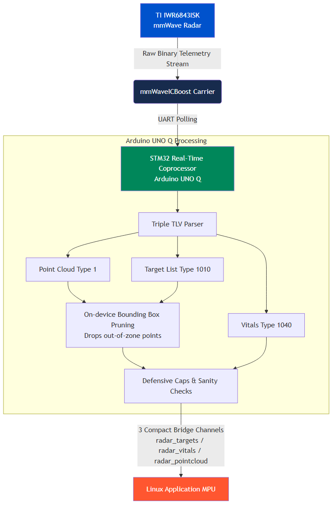
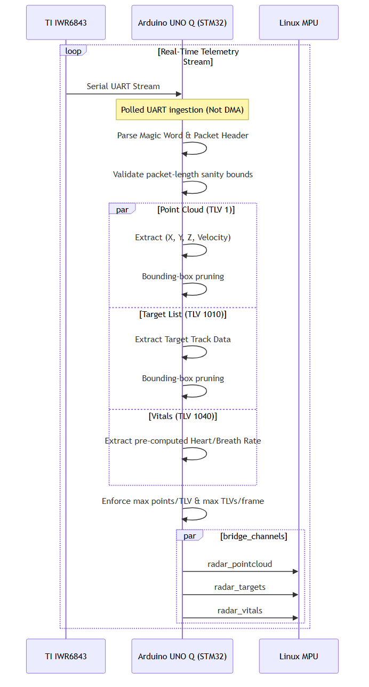

<p align="center">
  
</p>

# Halo: Non-Contact Edge mmWave Fall Detector for Elder Care

Halo is a privacy-first, non-contact monitoring system for elder care facilities and private homes. It uses a Texas Instruments IWR6843ISK mmWave radar sensor to detect falls, track presence, and extract vital signs — no cameras, no wearables, no cloud dependency.

This repository contains the MCU firmware (Arduino UNO Q), the Linux edge application (Python, 4-thread), the trained PyTorch fall detection model, and the Home Assistant + Mosquitto dashboard stack.

## 🌟 Key Features

*   **Privacy-First:** No optical sensors. Only abstract 3D point clouds and bounding boxes are processed. Raw radar data never leaves the device.
*   **Fully On-Edge:** All inference runs locally on the Linux MPU. No cloud uplink is required for detection.
*   **Vital Signs Monitoring:** Heart rate and breathing rate are computed on the radar chip itself (TI's Vital Signs firmware). The host only consumes the pre-calculated values.
*   **Fall Detection:** A PyTorch CNN (`MyCNN`) classifies 25-frame rolling windows of point cloud data and emits a binary Fall/Not-Fall prediction with a confidence score.
*   **Real-Time Alerting:** Confirmed falls (`p > 0.85`) and sustained breath-rate anomalies trigger MQTT publishes and HTTP webhooks to Home Assistant, which dispatches ntfy push notifications to a phone.

---

## Hardware Setup & Radar Configuration

<p align="center"></p>

The IWR6843ISK antenna module must be mounted on the MMWAVEICBOOST carrier board. The ICBOOST provides the XDS110 debug/flash interface, barrel jack power input, and the RS-232 level-shifted UART headers (J5, J6) used for Arduino communication. Do not use the USB port on the green ISK antenna board for flashing or data — only the XDS110 USB port on the ICBOOST.

### 1. Prerequisites & Downloads

1. **TI Radar Toolbox** — Download `radar_toolbox_3_30_00_06` from the [TI Resource Explorer](https://dev.ti.com/tirex/explore/node?node=A__AEIJm0rwIeU.2P1OBWwlaA__radar_toolbox__1AslXXD__LATEST). Extract to `C:\ti\`.
2. **TI UniFlash** — Download and install from [ti.com/tool/UNIFLASH](https://www.ti.com/tool/UNIFLASH). Required to flash the radar firmware binary.
3. **XDS110 Drivers** — Installed automatically by UniFlash. Required because the ICBOOST uses the XDS110 USB-to-UART bridge, not a standard USB CDC device.

### 2. Flashing the Firmware

The radar ships with no application firmware. It must be flashed before first use.

1. **Set SOP switches to Flashing Mode** — On the ICBOOST, locate the S1 switch bank (SOP0, SOP1, SOP2):
   * **SOP0:** ON | **SOP1:** OFF | **SOP2:** ON
2. **Connect to PC** — Connect 5V/3A barrel jack power to the ICBOOST. Plug Micro-USB into the **XDS110 USB port** on the ICBOOST only.
3. **Open UniFlash** — Select device `IWR6843ISK`. Under Settings, enter the COM port for the **Application/User UART** (visible in Windows Device Manager).
4. **Select Binary** — Program tab → Meta Image 1 → browse to:
   ```
   C:\ti\radar_toolbox_3_30_00_06\radar_toolbox_3_30_00_06\source\ti\examples\
   Industrial_and_Personal_Electronics\Vital_Signs\
   Vital_Signs_With_People_Tracking\prebuilt_binaries\
   vital_signs_tracking_6843ISK_demo.bin
   ```
5. **Flash** — Click `Load Image`. Wait for "Success".
6. **Set SOP switches to Functional Mode** — Power off, then set:
   * **SOP0:** ON | **SOP1:** OFF | **SOP2:** OFF
7. Power on. The radar is now running the Vital Signs + Tracking firmware.

### 3. COM Ports

When the ICBOOST is connected via XDS110 USB, Windows enumerates **two** COM ports under "Ports (COM & LPT)":

| Port | Name in Device Manager | Baud | Purpose |
|---|---|---|---|
| CFG_PORT | XDS110 Class Application/User UART | 115200 | Send `.cfg` commands to start the sensor |
| DATA_PORT | XDS110 Class Auxiliary Data Port | 921600 | Receive binary TLV telemetry stream |

### 4. Radar Configuration

The radar is stateless at power-on. It must receive a complete configuration file over CFG_PORT before it will emit any data.

**Config file used:**
```
C:\ti\radar_toolbox_3_30_00_06\radar_toolbox_3_30_00_06\source\ti\examples\
Industrial_and_Personal_Electronics\Vital_Signs\
Vital_Signs_With_People_Tracking\chirp_configs\vital_signs_ISK_6m.cfg
```

**Sending the config — two options:**

* **Option A (GUI):** Run the Industrial Visualizer at `\tools\visualizers\Industrial_Visualizer` in the toolbox. Select the correct XDS110 COM ports, select the "Vital Signs with People Tracking" lab, load `vital_signs_ISK_6m.cfg`, and click Start.
* **Option B (Arduino sketch):** The `sketch.ino` firmware embeds the full config as a `const char* radarConfig[]` array. At boot, it sends each line to the radar over Serial1 (115200 baud) with a 5-second delay for radar boot time. No manual config step is required when the Arduino is in use.

---

## 🚀 Setup and Deployment

### 1. Arduino MCU Setup & Wiring

<p align="center"></p>

<p align="center"></p>

The Arduino UNO Q (STM32-based) bridges the ICBOOST's UART headers to the Linux host over USB. It parses the raw TLV binary stream from the radar and re-emits three separate structured channels over the `Arduino_RouterBridge` protocol.

**Wiring (Arduino UNO Q ↔ MMWAVEICBOOST):**

| Arduino Pin | ICBOOST Header | Direction | Baud | Purpose |
|---|---|---|---|---|
| GND | J5 Pin 4 (GND) | — | — | Common ground. Required for UART signal integrity. |
| D0 (USART1_RX) | J5 Pin 3 (RS232TX) | Radar → Arduino | 115200 | Config UART receive (CFG channel) |
| D1 (USART1_TX) | J5 Pin 5 (RS232RX) | Arduino → Radar | 115200 | Config UART transmit (sends `.cfg` commands) |
| RX (Hardware Serial) | J6 Pin 9 (Data TX) | Radar → Arduino | 921600 | High-speed TLV data stream |

> [!IMPORTANT]
> Power the ICBOOST from its dedicated 5V/3A barrel jack. Do **not** attempt to power it from the Arduino's 5V pin. The radar draws up to 3A at peak; the Arduino's regulator cannot supply this.

**Flashing the Arduino:**
1. Open `src/mcu_arduino/sketch.ino` in Arduino IDE.
2. Install the `Arduino_RouterBridge` library if not already present.
3. Select board: **Arduino UNO R4 / UNO Q (STM32)**.
4. Flash. The sketch will configure the radar automatically on boot.

### 2. Linux MPU Setup

The Python application requires Python 3.8+ and the `arduino` bridge package (provided by the `Arduino_RouterBridge` host library).

```bash
cd src/mpu_linux
pip install -r requirements.txt
```

`requirements.txt` uses `--extra-index-url https://download.pytorch.org/whl/cpu` so `torch` is pulled from TI's CPU-only wheel index. Standard PyPI packages (`requests`, `paho-mqtt`, `numpy`) resolve from the default index alongside it.

Before running, set the serial port in `main.py` to match your Arduino's USB device path (e.g. `COM3` on Windows, `/dev/ttyACM0` on Linux). Then:

```bash
python main.py
```

The application prints per-thread startup confirmations and a diagnostic counter every 100 pointcloud batches. If `[Thread2] First pointcloud batch received` does not appear within ~5 seconds of start, the radar is not emitting data — verify the SOP switch state and CFG_PORT connection.

---

## 🏗️ System Architecture

<p align="center"></p>

The system has three compute tiers:

*   **Tier 1 — Radar Sensor (IWR6843ISK):** Runs TI's Vital Signs + Tracking firmware on-chip. Outputs pre-clustered target lists, compressed point clouds, and pre-computed heart/breath rates over UART at 921600 baud.
*   **Tier 2 — Real-Time Coprocessor (Arduino UNO Q / STM32):** Parses the raw binary TLV stream in real time. Applies spatial bounding-box pruning and sanity validation, then re-emits three structured channels (`radar_targets`, `radar_vitals`, `radar_pointcloud`) to the Linux host over USB.
*   **Tier 3 — Linux Application MPU (Python):** Four-thread application that consumes the three channels, runs fall detection inference, and dispatches alerts.

---

## 📡 Data Pipeline & Telemetry

<p align="center"></p>

The radar streams binary TLV (Type-Length-Value) packets at each frame interval. Each packet begins with an 8-byte magic word (`0x02 0x01 0x04 0x03 0x06 0x05 0x08 0x07`) followed by a 40-byte header, then one or more TLV payloads.

### TLV Types Parsed by the Sketch

| TLV Type | Content | Output Channel |
|---|---|---|
| **1** | Raw point cloud: `(frameNum, x, y, z, doppler_velocity)` per point | `radar_pointcloud` |
| **1010** | Tracked target list: `(frameNum, tid, x, y, z)` per target (112-byte struct: 1× uint32 + 27× float) | `radar_targets` |
| **1020** | Compressed point cloud: encoded as `(elev, azim, doppler, range)` int8/int16 with per-frame scale units | `radar_pointcloud` |
| **1040** | Vitals: `(id, rangeBin, breathDeviation, heartRate, breathRate)` | `radar_vitals` |

Types 1011, 1012 are parsed but not forwarded. Any other TLV type aborts the remainder of that frame immediately.

### On-Device Bounding Box & Sanity Filtering

All filtering runs on the Arduino before data reaches the Linux host. The active spatial bounds (matching `boundaryBox` in the radar config):

| Axis | Min | Max |
|---|---|---|
| X | −4.0 m | 4.0 m |
| Y | 0.3 m | 6.0 m |
| Z | 0.0 m | 3.0 m |

Points outside these bounds are silently dropped. Per-frame sanity limits: max 200 points per TLV, max packet length 16384 bytes, max 20 TLVs per frame. Vitals records with heart rate outside [30, 220] bpm, breath rate outside [3, 60] bpm, or `|breathDeviation| > 100` are rejected as UART corruption.

---

## 🧠 Linux Application MPU Architecture

<p align="center"></p>

The Python application uses four daemon threads. All Bridge callbacks do nothing except enqueue raw bytes into `queue.Queue` objects — parsing never blocks receive.

### Thread Breakdown

*   **Thread 1 — Spatial Engine:** Consumes `radar_targets`. Each target record is a 20-byte struct (`<2I3f`: frameNum, tid, x, y, z). Maintains `active_targets` dict keyed by tid. Runs `check_fall()` per target per frame. A target must appear in at least 2 consecutive frames (`REQUIRED_CONSECUTIVE_FRAMES = 2`) before it is tracked.

*   **Thread 2 — Activity Classifier:** Consumes `radar_pointcloud`. Each record is a 20-byte struct (`<I4f`: frameNum, x, y, z, doppler). Accumulates a rolling window of 25 frames (`MODEL_WINDOW_FRAMES = 25`), padded to 22 points per frame (`MODEL_MAX_POINTS = 22`) using zero-padding. On each complete window, runs `MyCNN` inference and publishes `fall_probability` to MQTT and the event queue. Falls with `p > 0.85` additionally publish `fall_cnn`.

*   **Thread 3 — Vitals Consumer:** Consumes `radar_vitals`. Each record is a 16-byte struct (`<2H3f`: id, rangeBin, breathDeviation, heartRate, breathRate). Applies the same sanity bounds as the sketch. Publishes every valid reading as `vitals_reading` to MQTT. If `breathRate` stays at 0 for ≥ 15 seconds (`VITALS_ZERO_BREATH_ALERT_SEC = 15.0`), emits `vitals_alert`.

*   **Thread 4 — Event Router:** Consumes `event_queue`. Appends every event to `python/events.jsonl`. Routes by event type:
    *   `vitals_reading` → MQTT `eldercare/radar/heart_rate` + `eldercare/radar/breath_rate` (bare float)
    *   `fall_probability` → MQTT `eldercare/radar/fall_probability` (bare float)
    *   `fall_cnn` (`p > 0.85`) → MQTT `eldercare/radar/falls` (JSON) + HTTP POST to HA webhook
    *   `vitals_alert` → MQTT `eldercare/radar/vitals` (JSON) + HTTP POST to HA webhook

### Fall Detection Thresholds (Thread 1)

These are mount-position dependent. Retune if the sensor height or angle changes.

| Constant | Value | Meaning |
|---|---|---|
| `FALL_DROP_THRESHOLD_M` | 0.4 m | Minimum Z drop within the window to flag a fall candidate |
| `FALL_WINDOW_FRAMES` | 20 | Number of frames in the Z-history deque per target |
| `FALL_FLOOR_Z_M` | 0.3 m | Z must settle at or below this value to confirm a fall |
| `FALL_SETTLE_FRAMES` | 15 | Consecutive frames at floor-level required before alert fires |

---

## 🏠 Home Assistant & Dashboard Integration

The `homeassistant/` directory is a self-contained Docker Compose stack. It runs Home Assistant and a Mosquitto MQTT broker on the same host.

### Directory Structure

```text
homeassistant/
├── docker-compose.yml          # Orchestrates HA + Mosquitto containers
├── config/
│   ├── configuration.yaml      # HA core config: MQTT sensors + rest_command for ntfy
│   ├── automations.yaml        # Emergency dispatch: fall_cnn + vitals_alert → ntfy push
│   ├── scripts.yaml            # (empty placeholder)
│   ├── scenes.yaml             # (empty placeholder)
│   └── secrets.yaml            # Secret store — do NOT commit real credentials
└── mosquitto/
    └── config/
        └── mosquitto.conf      # Broker config: port 1883, anonymous, persistent
```

### 1. Running the Stack

```bash
cd homeassistant
docker compose up -d
```

Home Assistant is available at `http://<host-ip>:8123`.

### 2. Mosquitto MQTT Broker

Configured in [`mosquitto/config/mosquitto.conf`](homeassistant/mosquitto/config/mosquitto.conf):

| Setting | Value |
|---|---|
| Port | `1883` |
| Authentication | Anonymous (`allow_anonymous true`) |
| Persistence | Enabled — stored in `/mosquitto/data/` |
| Logging | File — `/mosquitto/log/mosquitto.log` |

> [!WARNING]
> `allow_anonymous true` is intentional for local LAN use. For a production deployment, enable password authentication in `mosquitto.conf`.

### 3. Home Assistant MQTT Sensors

Defined in [`config/configuration.yaml`](homeassistant/config/configuration.yaml). Each sensor subscribes to a dedicated topic carrying a **bare numeric payload** (not JSON). This is required — HA's MQTT sensor cannot cast a JSON blob to a numeric state without an explicit `value_template`.

| Sensor Name | MQTT Topic | Unit |
|---|---|---|
| Radar Heart Rate | `eldercare/radar/heart_rate` | bpm |
| Radar Breath Rate | `eldercare/radar/breath_rate` | bpm |
| Fall Probability | `eldercare/radar/fall_probability` | — |

### 4. Emergency Dispatch Automation & ntfy Push Notifications

The [`config/automations.yaml`](homeassistant/config/automations.yaml) defines the `Radar Emergency Dispatch` automation. It is triggered by HTTP POST to `/api/webhook/emergency_dispatch` (webhook ID: `emergency_dispatch`, methods: POST, `local_only: false`). It runs in `parallel` mode to handle simultaneous events.

| `trigger.json.type` | HA Action | ntfy Action |
|---|---|---|
| `fall_cnn` | `persistent_notification.create` with confidence % and timestamp | Push: "Fall Detected — X% confidence at HH:MM:SS" |
| `vitals_alert` | `persistent_notification.create` with duration and target ID | Push: "No breath rate for Xs (ID N) at HH:MM:SS" |

ntfy push uses [`rest_command.ntfy_notify`](homeassistant/config/configuration.yaml) in `configuration.yaml`, which posts to `https://ntfy.sh/halo-radar-9dfc55e71cdb` with `Priority: urgent`. Install the [ntfy app](https://ntfy.sh/) and subscribe to that topic to receive alerts on your phone.

> [!TIP]
> Change the `url` under `rest_command.ntfy_notify` to your own private ntfy topic for production use.

### 5. Connecting the MPU to Home Assistant

In `src/mpu_linux/main.py`, set these constants to your host machine's LAN IP:

```python
WEBHOOK_URL    = "http://<HA_HOST_IP>:8123/api/webhook/emergency_dispatch"
MQTT_BROKER_IP = "<HA_HOST_IP>"
MQTT_PORT      = 1883
```

> [!IMPORTANT]
> Use the host machine's real LAN IP (run `hostname -I` on Linux or `ipconfig` on Windows). Do **not** use `127.0.0.1` — the MPU and Mosquitto run in separate Docker containers; loopback resolves to the calling container only.

**Full event flow once configured:**

| Event | MQTT | Webhook |
|---|---|---|
| Every valid vitals reading | `heart_rate` + `breath_rate` topics (bare float) | — |
| Every classifier window | `fall_probability` topic (bare float, 0.0–1.0) | — |
| Fall confirmed (`p > 0.85`) | `eldercare/radar/falls` (JSON blob) | POST → HA automation → ntfy push |
| Breath-rate absent ≥ 15 s | — | POST → HA automation → ntfy push |

---

## ⚙️ Model Training & AI

### Architecture

`MyCNN` is a 2D convolutional classifier defined in `src/mpu_linux/main.py` and mirrored exactly in `model_training/notebooks/FallDetection_root.ipynb`. The two definitions must be kept in sync — the `.pth` file stores weights only (`state_dict`), not the model class. Loading requires an instantiated `MyCNN` object.

```
Input: (1, 25, 22, 4)   ← (batch, frames, max_points, features)
Conv2d(25→16, k=5, s=2, p=2) + LeakyReLU
MaxPool2d(2, 2)
Conv2d(16→32, k=3, s=1, p=1) + LeakyReLU
Flatten → Linear(32×5×1=160, 64) + LeakyReLU
Linear(64, 32) + LeakyReLU
Linear(32, 1) → sigmoid → probability
```

All layers use `dtype=torch.float32`.

### Input Tensor

| Dimension | Size | Content |
|---|---|---|
| Batch | 1 (inference) | — |
| Frames | 25 (`MODEL_WINDOW_FRAMES`) | Rolling window of radar frames |
| Max Points | 22 (`MODEL_MAX_POINTS`) | Points per frame, zero-padded if fewer detected |
| Features | 4 | `(X, Y, Z, Doppler_Velocity)` |

`MODEL_MAX_POINTS = 22` must match the value used during training (the notebook's `equal_newdf` min-max object count). If retraining produces a different value, update `MODEL_MAX_POINTS` in `main.py` and recompute `fc1`'s `in_features` (`32 × H_out × W_out` after conv/pool arithmetic).

### Files

*   **Model weights:** `src/mpu_linux/fall_model.pth` (loaded at path `python/fall_model.pth` relative to the working directory — run `python main.py` from `src/mpu_linux/`)
*   **Training notebook:** `model_training/notebooks/FallDetection_root.ipynb`
*   **Training data:** `model_training/data/GatheredData/` (not tracked in git — collect using the radar + Arduino setup)

---

## 📂 Repository Structure

```text
├── docs/
│   ├── diagrams/             # Mermaid source (.mmd) + rendered PNGs
│   └── images/               # Hardware photos and pinout diagrams
├── homeassistant/
│   ├── docker-compose.yml    # Docker stack: Home Assistant + Mosquitto
│   ├── config/               # Home Assistant configuration
│   └── mosquitto/config/     # Mosquitto broker configuration
├── model_training/
│   ├── data/                 # Pointcloud capture CSVs (not git-tracked)
│   └── notebooks/            # FallDetection_root.ipynb
└── src/
    ├── mcu_arduino/          # sketch.ino — TLV parser + radar config + bridge
    └── mpu_linux/            # main.py — 4-thread Python edge application
```

---
*Developed for elder care environments demanding the highest degree of privacy, dignity, and reliability.*
