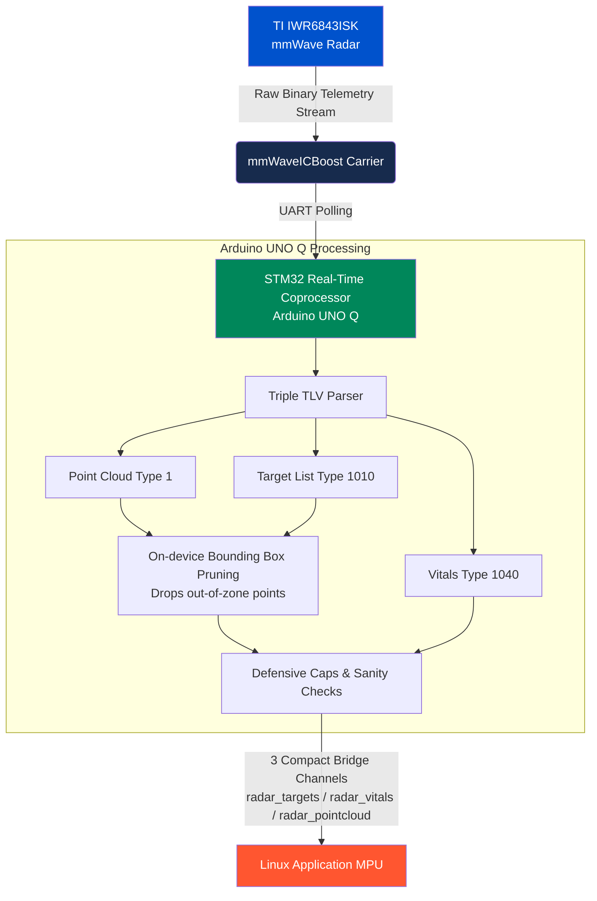
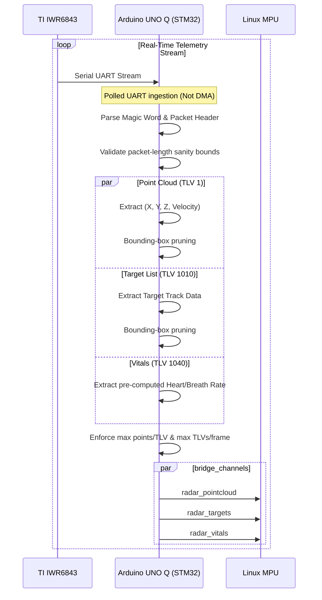
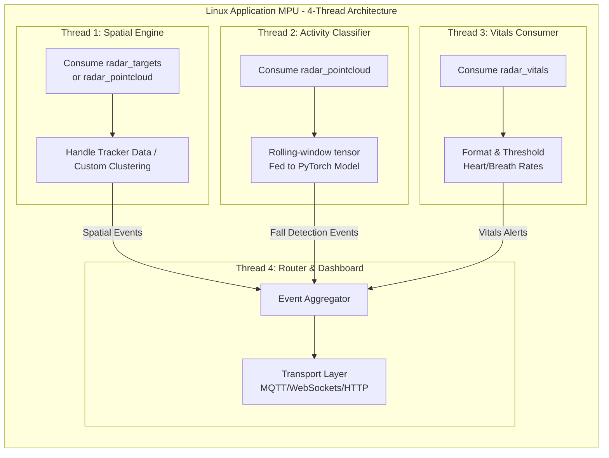

# Halo: Non-Contact Edge mmWave Fall Detector for Elder Care

Halo is a privacy-first, non-contact monitoring system designed for elder care facilities and private homes. By leveraging high-frequency mmWave radar technology, it provides highly accurate fall detection, presence tracking, and vital signs monitoring without the use of invasive cameras or wearable devices. 

This repository contains the hardware integration, edge-processing logic, and machine learning models required to run the Halo system locally on edge devices.

## 🌟 Key Features

*   **Privacy-First Design:** Complete absence of optical cameras; only abstract point cloud data and bounding boxes are processed.
*   **Edge Computing:** No constant cloud uplink required for detection—minimizes latency and removes privacy concerns related to raw data transmission.
*   **Vital Signs Monitoring:** Real-time heart rate and breathing rate extraction computed directly on the radar chip.
*   **Robust Fall Detection:** Utilizes a PyTorch-based neural network trained on point cloud dynamics to classify activities and detect falls.

---

## 🏗️ System Architecture

The Halo system architecture is distributed across three primary compute tiers: the Radar Sensor, the Real-Time Coprocessor, and the Linux Application MPU.



### 1. Hardware Stack

*   **Texas Instruments IWR6843ISK:** A 60-GHz to 64-GHz mmWave sensor. Flashed with the Vital Signs + Tracking firmware from the TI Radar Toolbox.
*   **mmWaveICBoost Carrier:** Provides standard interfaces, debugging capabilities, and bridges the high-speed telemetry to the coprocessor.
*   **Arduino UNO Q (STM32 MCU):** Acts as the real-time telemetry ingester and parser.

---

## 📡 Data Pipeline & Telemetry

The TI radar streams a highly condensed raw binary telemetry output. The STM32 microcontroller is responsible for parsing this real-time stream into actionable structural data.

### The Parsing Engine

The telemetry is formatted using Type-Length-Value (TLV) packets. The MCU implements a custom parser based on `parseTLVs.py` specifications to decode three primary structs:

1.  **Point Cloud (Type 1):** Returns the 3D spatial points $(X, Y, Z)$ and Doppler velocity of moving subjects.
2.  **Target List (Type 1010):** Returns the tracked targets, handled by the IWR6843's on-chip grouping and tracking algorithms.
3.  **Vitals (Type 1040):** Returns pre-calculated, filtered heart rate and respiration rate values.



### Spatial Filtering and Defensive Bounds

Because edge MPUs have limited resources, the MCU implements physical world constraints *before* passing data upstream:
*   **Bounding-Box Pruning:** Points that fall outside the defined physical room bounds are instantly dropped to prevent ghosting or processing artifacts.
*   **Sanity Caps:** The parser strictly enforces maximum points per TLV, maximum TLVs per frame, and absolute packet-length sanity to prevent buffer overruns or segmentation faults in the Linux MPU.

---

## 🧠 Linux Application MPU Architecture

The downstream Linux application (implemented in Python) acts as the brain of the edge device. To ensure real-time latency, it uses a 4-Thread architecture.



### Thread Breakdown

*   **Thread 1: Spatial Engine:** Consumes the `radar_targets` channel. Uses the pre-tracked target lists from the TI chip, or performs custom DBSCAN/K-Means clustering on the `radar_pointcloud` if the on-chip tracker loses confidence.
*   **Thread 2: Activity Classifier:** Consumes the `radar_pointcloud` channel. Aggregates data into a rolling-window time-series tensor. This tensor is fed into the PyTorch Neural Network (`fall_model.pth`) to classify activities and trigger Fall Detection alerts.
*   **Thread 3: Vitals Consumer:** Consumes the `radar_vitals` channel. The phase-shift algorithms run on the TI radar, so this thread is purely responsible for smoothing, formatting, and thresholding critical heart and breath rate deviations.
*   **Thread 4: Router & Dashboard:** The event aggregator and transport layer. Publishes the serialized events (falls, vital spikes, presence) to a local dashboard or an external MQTT/HTTP server.

---

## 📂 Repository Structure

The project has been refactored into a highly modular directory structure:

```text
├── docs/
│   └── diagrams/             # High-resolution Mermaid diagrams
├── model_training/
│   ├── data/                 # Raw datasets and pointcloud captures
│   └── notebooks/            # Jupyter notebooks (e.g., FallDetection.ipynb)
└── src/
    ├── mcu_arduino/          # STM32 / Arduino UNO Q parser sketch
    └── mpu_linux/            # The 4-Thread Python backend application
```

## ⚙️ Model Training & AI

The Fall Detection model is a PyTorch-based sequence classifier. 
*   **Notebook:** Located at `model_training/notebooks/FallDetection_root.ipynb`.
*   **Weights:** The production weights are saved as `src/mpu_linux/fall_model.pth`.
*   **Data:** Training datasets are stored in `model_training/data/GatheredData`.

## 🚀 Setup and Deployment

### 1. Arduino MCU Setup
1. Open `src/mcu_arduino/sketch.ino` in the Arduino IDE.
2. Select your STM32 / Arduino UNO Q board configuration.
3. Flash the firmware to enable the TLV parser and bridge channels.

### 2. Linux MPU Setup
1. Navigate to the Python application directory:
   ```bash
   cd src/mpu_linux
   ```
2. Install the required dependencies:
   ```bash
   pip install -r requirements.txt
   ```
3. Run the main multi-threaded application:
   ```bash
   python main.py
   ```

*(Ensure the Arduino is connected via USB/Serial and the port is correctly mapped in `main.py`).*

---
*Developed for elder care environments demanding the highest degree of privacy, dignity, and reliability.*
