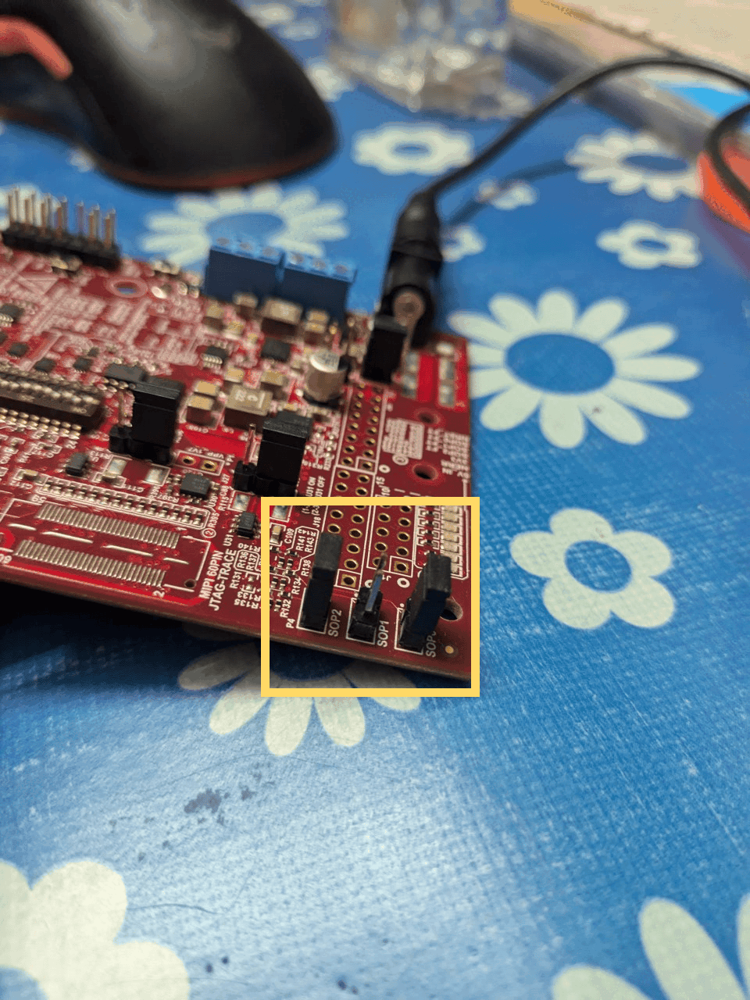
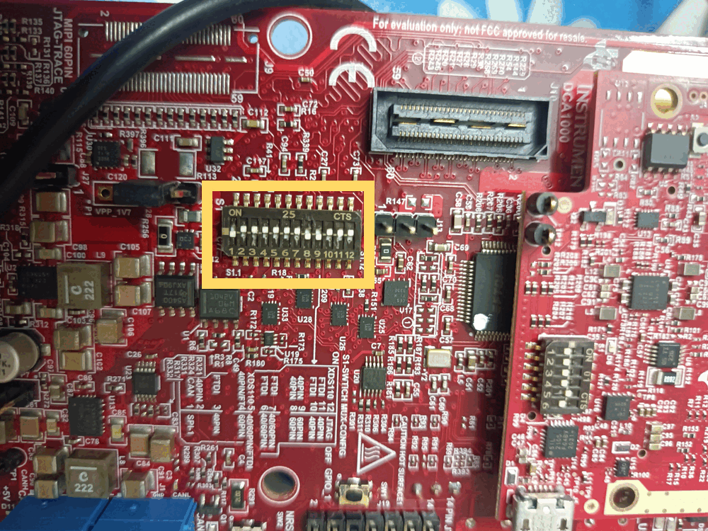
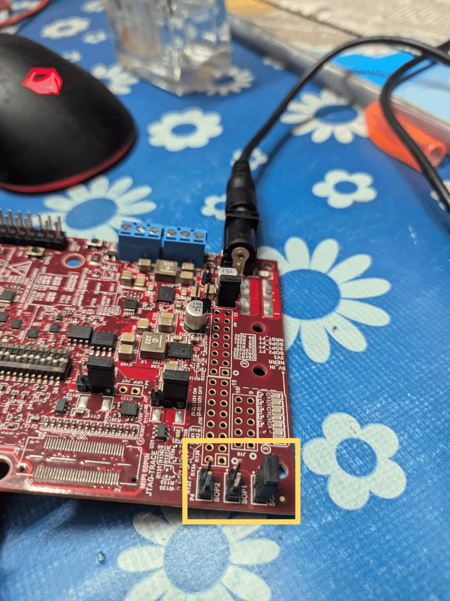
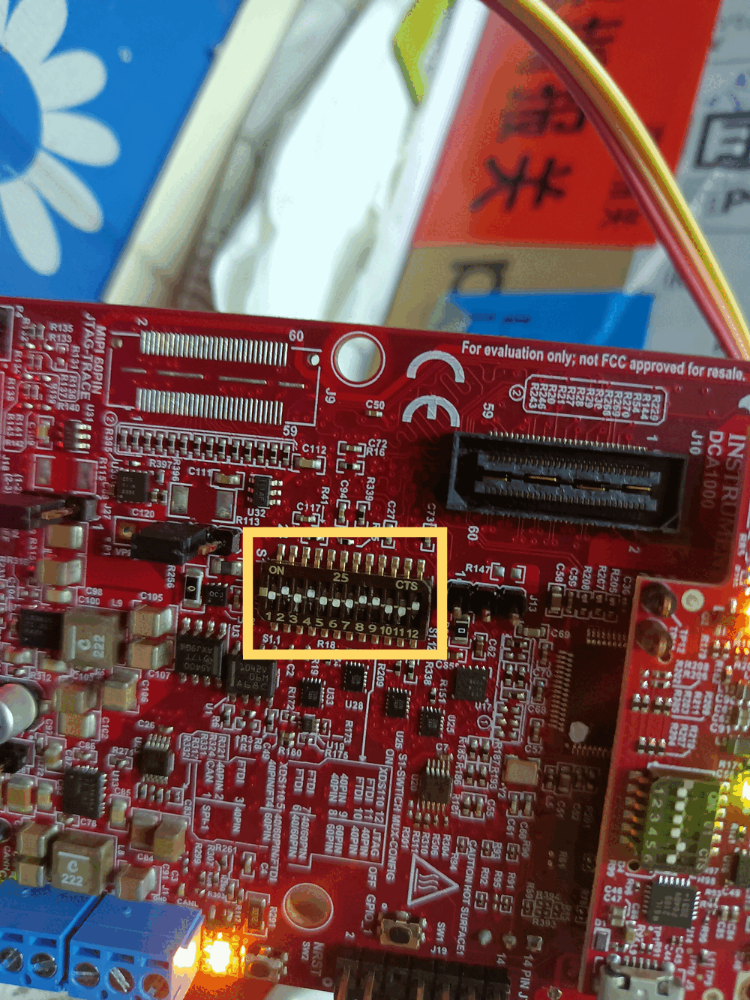
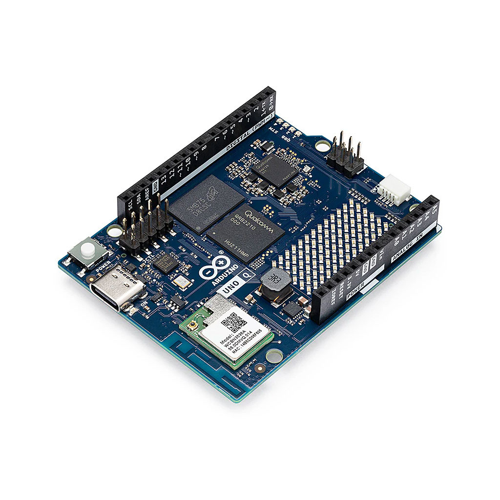
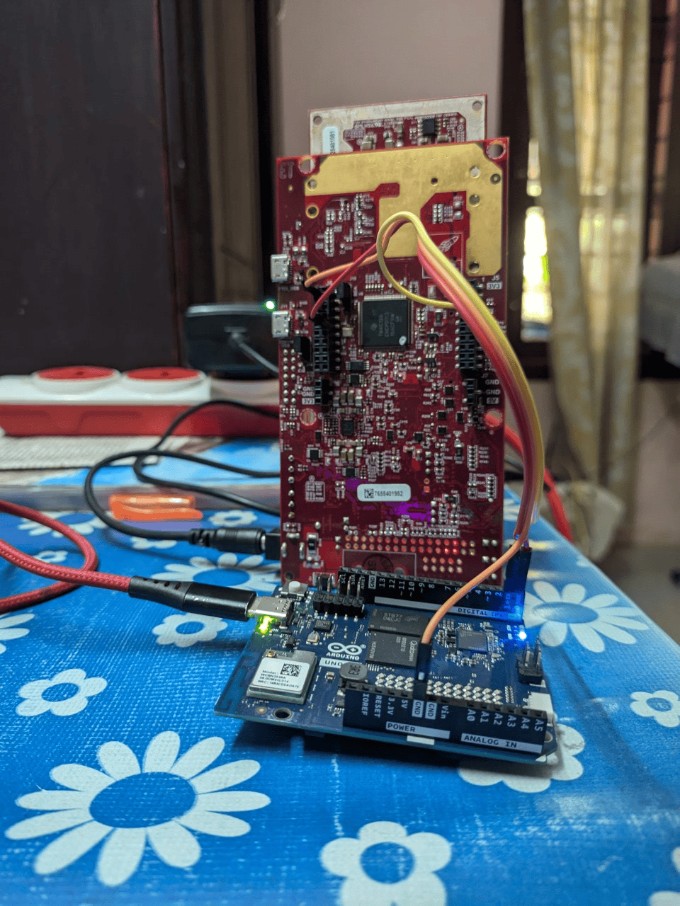

<p align="center">
  <br/>
  <em>Halo: Privacy-First Non-Contact Edge mmWave Fall Detector</em>
</p>

# Halo: Non-Contact Edge mmWave Fall Detector for Elder Care

Halo is a privacy-first, non-contact monitoring system for elder care facilities and private homes. It uses a Texas Instruments IWR6843ISK mmWave radar sensor to detect falls, track presence, and extract vital signs — no cameras, no wearables, no cloud dependency.

This repository contains the MCU firmware (Arduino UNO Q), the Linux edge application (Python, 4-thread), the trained PyTorch fall detection model, and the Home Assistant + Mosquitto dashboard stack.

---

## 🌟 Key Features

*   **Privacy-First:** No optical sensors. Only abstract 3D point clouds and bounding boxes are processed. Raw radar data never leaves the device.
*   **Fully On-Edge:** All inference runs locally on the Linux MPU. No cloud uplink is required for detection.
*   **Vital Signs Monitoring:** Heart rate and breathing rate are computed on the radar chip itself (TI's Vital Signs firmware). The host only consumes the pre-computed values — no DSP required on the host.
*   **Fall Detection:** A PyTorch CNN (`MyCNN`) classifies 25-frame rolling windows of point cloud data and emits a binary Fall/Not-Fall prediction with a confidence score.
*   **Real-Time Alerting:** Confirmed falls (`p > 0.85`) and sustained breath-rate anomalies trigger MQTT publishes and HTTP webhooks to Home Assistant, which dispatches ntfy push notifications to a phone.

---

## Radar Configuration

<p align="center">
  <br/>
  <em>IWR6843ISK antenna module mounted on the MMWAVEICBOOST carrier board</em>
</p>

<p align="center">
  <br/>
  <em>TI IWR6843ISK — 60 GHz FMCW mmWave radar with on-chip vital signs processing</em>
</p>

The IWR6843ISK antenna module must be mounted on the MMWAVEICBOOST carrier board. The ICBOOST provides the XDS110 debug/flash interface, barrel jack power input (5 V/3 A), and the RS-232 level-shifted UART headers (J5, J6) used for Arduino communication.

> [!WARNING]
> Do **not** use the USB port on the green IWR6843ISK antenna board for flashing or data. Only the **XDS110 USB port** on the ICBOOST (the larger white board) is used.

### 1. Prerequisites & Downloads

1. **TI Radar Toolbox** — Download `radar_toolbox_3_30_00_06` from the [TI Resource Explorer](https://dev.ti.com/tirex/explore/node?node=A__AEIJm0rwIeU.2P1OBWwlaA__radar_toolbox__1AslXXD__LATEST). Extract to `C:\ti\`.
2. **TI UniFlash** — Download and install from [ti.com/tool/UNIFLASH](https://www.ti.com/tool/UNIFLASH). Required to flash the radar firmware binary.
3. **XDS110 Drivers** — Installed automatically by UniFlash. Required because the ICBOOST uses the XDS110 USB-to-UART bridge, not a standard USB CDC device.

### 2. Flashing the Firmware

The radar ships with no application firmware. It must be flashed before first use.

> [!IMPORTANT]
> Vitals monitoring (heart rate and breathing rate) **requires** TI's dedicated "Vital Signs With People Tracking" prebuilt binary. It is **not** obtainable from the standard tracking binary — a separate flash is required. This is confirmed by TI's E2E forum and product documentation.

#### Step 1 — Set switches for Flashing Mode

Power off the board. Set the SOP and MUX switches to route UART to the XDS110 USB and enable flashing:

> [!IMPORTANT]
> **SOP (S1) Switches:**
> 
> | Switch | State |
> |---|---|
> | S1.1 (SOP0) | **ON** |
> | S1.2 (SOP1) | **OFF** |
> | S1.3 (SOP2) | **ON** |

**MUX/DIP Switches (Flashing Mode):**

| Switch | State |
|---|---|
| 1 | **OFF** |
| 2 | **ON** |
| 3 | **ON** |
| 4 | **ON** |
| 5 | **ON** |
| 6 | **ON** |
| 7 | **ON** |
| 8 | **OFF** |
| 9 | **OFF** |
| 10 | **ON** |
| 11 | **ON** |
| 12 | **ON** |

<p align="center">
  <br/>
  <em>SOP switch configuration for Flashing Mode — SOP2 must be ON to enter the bootloader</em>
</p>

<p align="center">
  <br/>
  <em>MUX switches routed to XDS110 USB — required for UniFlash to communicate with the chip</em>
</p>

#### Step 2 — Connect and Flash

1. Connect the 5 V/3 A barrel jack to the ICBOOST.
2. Plug Micro-USB into the **XDS110 USB port** on the ICBOOST only.
3. Open **UniFlash** → select device `IWR6843ISK` → under Settings, enter the COM port for the **Application/User UART** (visible in Windows Device Manager).
4. Program tab → Meta Image 1 → browse to:
   ```
   C:\ti\radar_toolbox_3_30_00_06\radar_toolbox_3_30_00_06\source\ti\examples\
   Industrial_and_Personal_Electronics\Vital_Signs\
   Vital_Signs_With_People_Tracking\prebuilt_binaries\
   vital_signs_tracking_6843ISK_demo.bin
   ```
5. Click **Load Image**. Wait for "Success".

#### Step 3 — Set switches for Functional Mode (Arduino UART)

Power off. Set the switches to route UART to the hardware headers and enable normal operation:

> [!IMPORTANT]
> **SOP (S1) Switches:**
> 
> | Switch | State |
> |---|---|
> | S1.1 (SOP0) | **ON** |
> | S1.2 (SOP1) | **OFF** |
> | S1.3 (SOP2) | **OFF** |

**MUX/DIP Switches (Functional Mode):**

| Switch | State |
|---|---|
| 1 | **OFF** |
| 2 | **ON** |
| 3 | **OFF** |
| 4 | **ON** |
| 5 | **OFF** |
| 6 | **OFF** |
| 7 | **OFF** |
| 8 | **ON** |
| 9 | **ON** |
| 10 | **OFF** |
| 11 | **OFF** |
| 12 | **ON** |

<p align="center">
  <br/>
  <em>SOP switches for Functional Mode — SOP2 OFF disables the bootloader and starts the application</em>
</p>

<p align="center">
  <br/>
  <em>MUX switches in Functional Mode — UART routed to hardware headers (J5/J6) for Arduino communication</em>
</p>

Power on. The radar is now running the Vital Signs + Tracking firmware and will start streaming TLV data once it receives a configuration.

### 3. COM Ports

When the ICBOOST is connected via XDS110 USB, Windows enumerates **two** COM ports under "Ports (COM & LPT)":

| Port | Name in Device Manager | Baud | Purpose |
|---|---|---|---|
| CFG_PORT | XDS110 Class Application/User UART | 115200 | Send `.cfg` commands to start the sensor |
| DATA_PORT | XDS110 Class Auxiliary Data Port | 921600 | Receive binary TLV telemetry stream |

> [!NOTE]
> 921,600 baud ≈ 92 KB/s. The STM32 ingests this via polled `Serial1.readBytes()`. True DMA UART ingestion is **not available** at the Arduino sketch level on this board — `ZephyrSerial` has no `setRxBufferSize()` method and buffer size is fixed by devicetree UART config. This is a confirmed architectural limitation, mitigated by fast on-device parsing and bounding-box pruning that reduces the bridge payload from multi-KB raw telemetry to ~20 bytes per target.

### 4. Radar Configuration

The radar is stateless at power-on. It must receive a complete configuration file over CFG_PORT before it will emit any data.

**Config file used:**
```
C:\ti\radar_toolbox_3_30_00_06\radar_toolbox_3_30_00_06\source\ti\examples\
Industrial_and_Personal_Electronics\Vital_Signs\
Vital_Signs_With_People_Tracking\chirp_configs\vital_signs_ISK_6m.cfg
```

**Sending the config — two options:**

* **Option A (GUI):** Run the Industrial Visualizer at `\tools\visualizers\Industrial_Visualizer` in the toolbox. Select the correct XDS110 COM ports, select the "Vital Signs with People Tracking" lab, load `vital_signs_ISK_6m.cfg`, and click Start.
* **Option B (Arduino sketch):** `sketch.ino` embeds the full config as a `const char* radarConfig[]` array. At boot, it sends each line over Serial1 (115200 baud) with a 5-second startup delay for radar boot time. No manual config step is required when using the Arduino.

### 5. Radar Config Tuning

The default vendor config (`vital_signs_ISK_6m.cfg`) is tuned for a **ceiling-mounted**, room-scale deployment aimed at near-static elderly movement. The parameters below were retuned for the actual table-mount geometry used in development (~0.75 m height, ~0.6 m range, active test movements):

| Parameter | Original | Retuned | Reason |
|---|---|---|---|
| `sensorPosition` | `2 0 15` (ceiling, tilted) | `0.75 0 0` (table, flat) | Matches real mount height and tilt |
| `boundaryBox` Ymin | `0.5` | `0.3` | Seated distance at ~0.6 m needs lean-forward margin |
| `maxAcceleration` | `0.1 0.1 0.1` | `2.0 2.0 2.0` | Original value dropped every track on normal walking speed |
| `stateParam` (active2freeThre) | `6` | `80` | Raises miss tolerance to ~4.4 s; prevents ID reset on short stop-then-resume gaps |

> [!CAUTION]
> The table-mount geometry cannot observe a real standing-to-floor fall arc — the observed Z range stays ~0–0.3 m, the same as the floor threshold. Fall detection at this mount demonstrates the *algorithm* and pipeline, not validated real-fall geometry. A genuine elder-care deployment requires the original **ceiling-mount** geometry (≥ 2 m height, tilted down) that this firmware profile was designed for.

---

## 🚀 Setup and Deployment

### 1. Arduino MCU Setup & Wiring

<p align="center">
  <br/>
  <em>MMWAVEICBOOST carrier board — J5 (left) and J6 (right) UART headers used for Arduino wiring</em>
</p>

<p align="center">
  <br/>
  <em>Arduino UNO Q pinout — D0 (RX) and D1 (TX) are the hardware UART pins wired to the ICBOOST</em>
</p>

**Arduino UNO Q — Dual-Processor Architecture:**

<p align="center">
  <br/>
  <em>Arduino UNO Q — dual-processor board with STM32H573 MCU and Linux MPU </em>
</p>

The Arduino UNO Q contains two processors on a single board:

| Processor | Core | Role |
|---|---|---|
| STM32H573 | Cortex-M33 @ 250 MHz | Real-time MCU — runs `sketch.ino`, parses TLV, drives GPIO |
| Linux MPU | NXP i.MX (Cortex-A) | Full Linux (Debian) — runs `python/main.py`, MQTT, inference |

The two processors communicate over an **internal UART** (not exposed externally). The `Arduino_RouterBridge` library on the STM32 side multiplexes named channels over this internal UART to the Linux MPU. The Python application on the Linux MPU opens the bridge via the `routerbridge` Python package — it does **not** open an external USB serial port. The board appears to the development PC as a USB CDC device only for flashing and the Arduino App Lab debugger connection.

**Wiring (Arduino UNO Q ↔ MMWAVEICBOOST):**

| Arduino Pin | ICBOOST Header | Direction | Baud | Purpose |
|---|---|---|---|---|
| GND | J5 Pin 4 (GND) | — | — | Common ground. Required for UART signal integrity. |
| D1 (USART1_TX) | J5 Pin 5 (RS232RX) | Arduino → Radar | 115200 | Config UART transmit (sends `.cfg` commands on boot) |
| D0 (USART1_RX) | J6 Pin 9 (Data TX) | Radar → Arduino | 921600 | High-speed TLV data stream |

<p align="center">
  <br/>
  <em>3-wire UART wiring: GND, D1 (TX→RS232RX), D0 (RX←Data TX) — keep wires short to minimise bit-flip corruption at 921,600 baud</em>
</p>

> [!IMPORTANT]
> Power the ICBOOST from its dedicated **5 V/3 A barrel jack**. Do **not** attempt to power it from the Arduino's 5 V pin. The IWR6843ISK draws up to 3 A at peak; the Arduino's onboard regulator cannot supply this.

> [!NOTE]
> At 921,600 baud over unshielded jumper wires, occasional bit-flip corruption is normal. The sketch applies per-field sanity bounds (X/Y/Z physically plausible ranges, heart rate 30–220 bpm, breath rate 3–60 bpm) to silently reject corrupted single-field values without discarding the whole frame. Shortening the jumper wires and using twisted-pair reduces the error rate further.

**STM32 ↔ Linux MPU Communication (Internal UART Bridge):**

The STM32H573 core communicates with the on-board Linux MPU over an **internal UART** using `Arduino_RouterBridge`. The bridge multiplexes three named channels:

| Channel Name | Content | Consumed by |
|---|---|---|
| `radar_targets` | Parsed target-list records (`<2I3f`) | Thread 1 — Spatial Engine |
| `radar_vitals` | Parsed vitals records (`<2H3f`) | Thread 3 — Vitals Consumer |
| `radar_pointcloud` | Decoded compressed point cloud (TLV 1020) | Thread 2 — Activity Classifier |

> [!NOTE]
> The bridge carries **results, not raw telemetry.** This is the central architectural decision — it reduces the per-frame bridge payload from multi-KB raw stream to ~20 bytes per target. All TLV parsing and bounding-box pruning happen on the STM32 before anything crosses the bridge.

On the Linux MPU side, `main.py` registers one callback per channel. Each callback does nothing except enqueue raw bytes into a `queue.Queue` — no parsing happens in the callback, decoupling receive latency from processing time.

**Flashing the Arduino:**
1. Open `src/mcu_arduino/sketch.ino` in Arduino IDE.
2. Install the `Arduino_RouterBridge` library if not already present.
3. Select board: **Arduino UNO R4 / UNO Q (STM32)**.
4. Flash. The sketch will configure the radar automatically on boot.

### 2. Linux MPU Setup

#### Option A: Arduino App Lab (Recommended)

<p align="center">
  <br/>
  <em>Arduino App Lab — unified IDE that runs the STM32 sketch and Python application simultaneously from a single project</em>
</p>

**Arduino App Lab** is an IDE built into the Arduino UNO Q environment that runs both the STM32 sketch and the Python application simultaneously from a single project. There is no need to run them separately or manage two terminals.

In App Lab, the project is structured with two top-level folders:
- `sketch/` — contains `sketch.ino` (compiled and flashed to the STM32)
- `python/` — contains `main.py`, `requirements.txt`, `fall_model.pth`, and runtime output files (`events.jsonl`, `pointcloud_log.csv`)

To run:
1. Open the App Lab project `radar_fall_detection`.
2. Click **Run** (top-right). App Lab flashes the sketch to the STM32 and starts `python/main.py` on the Linux MPU simultaneously.
3. The **App launch** tab shows the STM32 flash and GDB session output. The **Python** tab shows `main.py` stdout.

<p align="center">
  <br/>
  <em>Arduino App Lab Python terminal — 4 threads active, MQTT connected, live vitals (Heart Rate: 73.7 bpm, Breath Rate: 15.1 bpm) and CNN classifications streaming in real time</em>
</p>

All output files (`events.jsonl`, `pointcloud_log.csv`) are written inside the `python/` folder.

#### Option B: Standalone (without App Lab)

If not using App Lab, flash `sketch.ino` separately via Arduino IDE, then:

```bash
cd src/mpu_linux
pip install -r requirements.txt
```

`requirements.txt` uses `--extra-index-url https://download.pytorch.org/whl/cpu` so `torch` pulls from the CPU-only wheel index. Standard packages (`requests`, `paho-mqtt`, `numpy`) resolve from PyPI.

> [!WARNING]
> Do **not** change `--extra-index-url` to `--index-url`. The latter **replaces** the default PyPI index for the entire file, causing `paho-mqtt` and other standard packages to fail resolution. `--extra-index-url` *adds* to PyPI, it does not replace it.

The RouterBridge connection is internal to the board — `main.py` communicates with the STM32 over the on-board UART bridge, **not** a USB serial port. No serial port path needs to be set. Then:

```bash
python main.py
```

The application prints per-thread startup confirmations. If `[Thread2] First pointcloud batch received` does not appear within ~5 seconds, the radar is not emitting data — verify the SOP switch state and CFG_PORT connection.

---

## 🏗️ System Architecture

<p align="center">
  <br/>
  <em>Three-tier edge processing pipeline: IWR6843ISK → Arduino UNO Q (STM32) → Linux MPU → Home Assistant</em>
</p>

The system has three compute tiers:

*   **Tier 1 — Radar Sensor (IWR6843ISK):** Runs TI's Vital Signs + Tracking firmware on-chip. Outputs pre-clustered target lists, compressed point clouds (TLV 1020), and pre-computed heart/breath rates (TLV 1040) over UART at 921,600 baud.
*   **Tier 2 — Real-Time Coprocessor (Arduino UNO Q / STM32H573):** Parses the raw binary TLV stream in real time. Applies spatial bounding-box pruning and per-field sanity validation, then re-emits three structured channels to the Linux MPU over the internal UART bridge.
*   **Tier 3 — Linux Application MPU (Python):** Four-thread application that consumes the three channels, runs fall detection inference, and dispatches alerts via MQTT and Home Assistant webhooks.

---

## 📡 Data Pipeline & Telemetry

<p align="center">
  <br/>
  <em>Full data flow: from radar TLV stream through STM32 parsing to Linux inference and Home Assistant alerting</em>
</p>

The radar streams binary TLV (Type-Length-Value) packets at each frame interval. Each packet begins with an 8-byte magic word (`0x02 0x01 0x04 0x03 0x06 0x05 0x08 0x07`) followed by a 40-byte header, then one or more TLV payloads.

### TLV Types Parsed by the Sketch

| TLV Type | Content | Output Channel |
|---|---|---|
| **1010** | Tracked target list: `(frameNum, tid, x, y, z)` per target (112-byte struct: 1× uint32 + 27× float) | `radar_targets` |
| **1020** | **Compressed** point cloud: 20-byte unit header (5 floats: elevUnit, azimUnit, dopplerUnit, rangeUnit, snrUnit) + 8 bytes per point (int8 elev, int8 azim, int16 doppler, uint16 range, uint16 snr) | `radar_pointcloud` |
| **1040** | Vitals: `(id, rangeBin, breathDeviation, heartRate, breathRate)` — 136-byte struct, pre-computed on-chip | `radar_vitals` |
| **1011, 1012** | Parsed but not forwarded | — |

> [!IMPORTANT]
> TLV type `1` (raw `x,y,z,doppler` float struct) is **not present** in the Vital Signs + Tracking binary. The actual point cloud stream is type **`1020`** (`MMWDEMO_OUTPUT_MSG_COMPRESSED_POINTS`) — a compressed spherical format requiring decompression via the per-frame unit header and then spherical-to-Cartesian conversion. Assuming type `1` (from other TI demo reference code) results in silently delivering zero point cloud data.

Any unrecognised TLV type aborts parsing of the remainder of that frame immediately.

### On-Device Bounding Box & Sanity Filtering

All filtering runs on the STM32 before data reaches the Linux MPU. Active spatial bounds (matching `boundaryBox` in the radar config):

| Axis | Min | Max |
|---|---|---|
| X | −4.0 m | 4.0 m |
| Y | 0.3 m | 6.0 m |
| Z | 0.0 m | 3.0 m |

Points outside these bounds are silently dropped. Per-frame sanity limits: max 200 points per TLV, max packet length 16,384 bytes, max 20 TLVs per frame. Vitals records with heart rate outside [30, 220] bpm, breath rate outside [3, 60] bpm, or `|breathDeviation| > 100` are rejected as UART corruption.

> [!NOTE]
> Target records with `Y = 0.00` and `Z = 0.00` simultaneously are also filtered out defensively. This degenerate pattern appears consistently in live output and likely represents a tracker coast/low-confidence state — cause unconfirmed against TI documentation, but these records carry no reliable signal for fall detection.

---

## 🧠 Linux Application MPU Architecture

<p align="center">
  <br/>
  <em>Linux MPU: four daemon threads consuming dedicated queues — receive callbacks only enqueue, never parse</em>
</p>

The Python application uses four daemon threads. All Bridge callbacks do nothing except enqueue raw bytes into `queue.Queue` objects — parsing never blocks receive.

### Thread Breakdown

*   **Thread 1 — Spatial Engine:** Consumes `radar_targets`. Each target record is a 20-byte struct (`<2I3f`: frameNum, tid, x, y, z). Maintains `active_targets` dict keyed by tid. Runs `check_fall()` per target per frame. A target must appear in at least 2 consecutive frames (`REQUIRED_CONSECUTIVE_FRAMES = 2`) before it is tracked.

*   **Thread 2 — Activity Classifier:** Consumes `radar_pointcloud`. Each point is a 20-byte struct (`<I4f`: frameNum, x, y, z, doppler). Accumulates a rolling window of 25 frames (`MODEL_WINDOW_FRAMES = 25`), zero-padded to 22 points per frame (`MODEL_MAX_POINTS = 22`). On each complete window, runs `MyCNN` inference and publishes `fall_probability` to MQTT. Falls with `p > 0.85` additionally publish `fall_cnn` and trigger the HA webhook.

*   **Thread 3 — Vitals Consumer:** Consumes `radar_vitals`. Each record is a 16-byte struct (`<2H3f`: id, rangeBin, breathDeviation, heartRate, breathRate). Applies the same sanity bounds as the sketch. Publishes **every valid reading** as `vitals_reading` to MQTT (continuous stream, not only on alert events). If `breathRate` stays at 0 for ≥ 15 seconds (`VITALS_ZERO_BREATH_ALERT_SEC = 15.0`), emits `vitals_alert`.

*   **Thread 4 — Event Router:** Consumes `event_queue`. Appends every event to `python/events.jsonl`. Routes by event type:
    *   `vitals_reading` → MQTT `eldercare/radar/heart_rate` + `eldercare/radar/breath_rate` (bare float)
    *   `fall_probability` → MQTT `eldercare/radar/fall_probability` (bare float)
    *   `fall_cnn` (`p > 0.85`) → MQTT `eldercare/radar/falls` (JSON) + HTTP POST to HA webhook
    *   `vitals_alert` → MQTT `eldercare/radar/vitals` (JSON) + HTTP POST to HA webhook

### Fall Detection Thresholds (Thread 1)

These are mount-position dependent. Retune if the sensor height or angle changes.

| Constant | Value | Meaning |
|---|---|---|
| `FALL_DROP_THRESHOLD_M` | 0.4 m | Minimum Z drop within the window to flag a fall candidate |
| `FALL_WINDOW_FRAMES` | 20 | Number of frames in the Z-history deque per target |
| `FALL_FLOOR_Z_M` | 0.3 m | Z must settle at or below this value to confirm a fall |
| `FALL_SETTLE_FRAMES` | 15 | Consecutive frames at floor-level required before alert fires |

---

## 🏠 Home Assistant & Dashboard Integration

The `homeassistant/` directory is a self-contained Docker Compose stack. It runs Home Assistant and a Mosquitto MQTT broker on the same host.

### Directory Structure

```text
homeassistant/
├── docker-compose.yml          # Orchestrates HA + Mosquitto containers
├── config/
│   ├── configuration.yaml      # HA core config: MQTT sensors + rest_command for ntfy
│   ├── automations.yaml        # Emergency dispatch: fall_cnn + vitals_alert → ntfy push
│   ├── scripts.yaml            # (empty placeholder)
│   ├── scenes.yaml             # (empty placeholder)
│   └── secrets.yaml            # Secret store — do NOT commit real credentials
└── mosquitto/
    └── config/
        └── mosquitto.conf      # Broker config: port 1883, anonymous, persistent
```

### 1. Running the Stack

```bash
cd homeassistant
docker compose up -d
```

Home Assistant is available at `http://<host-ip>:8123`.

<div align="center">
  <br/>
  <em>Home Assistant — "Fall Detector and Vitals" dashboard showing live heart rate, breath rate gauges and fall probability history</em>
</div>

### 2. Mosquitto MQTT Broker

Configured in [`mosquitto/config/mosquitto.conf`](homeassistant/mosquitto/config/mosquitto.conf):

| Setting | Value |
|---|---|
| Port | `1883` |
| Authentication | Anonymous (`allow_anonymous true`) |
| Persistence | Enabled — stored in `/mosquitto/data/` |
| Logging | File — `/mosquitto/log/mosquitto.log` |

> [!WARNING]
> `allow_anonymous true` is intentional for local LAN use only. For any production deployment, enable password authentication in `mosquitto.conf`.

### 3. Home Assistant MQTT Sensors

Defined in [`config/configuration.yaml`](homeassistant/config/configuration.yaml). Each sensor subscribes to a dedicated topic carrying a **bare numeric payload** (not JSON). This is required — HA's MQTT sensor cannot cast a JSON blob to a numeric state without an explicit `value_template`, and the dedicated bare-numeric topics avoid that complexity.

| Sensor Name | MQTT Topic | Unit |
|---|---|---|
| Radar Heart Rate | `eldercare/radar/heart_rate` | bpm |
| Radar Breath Rate | `eldercare/radar/breath_rate` | bpm |
| Fall Probability | `eldercare/radar/fall_probability` | — |

<div align="center">
  <br/>
  <em>Home Assistant History view — fall probability sensor stream over a live test session</em>
</div>

### 4. Emergency Dispatch Automation & ntfy Push Notifications

The [`config/automations.yaml`](homeassistant/config/automations.yaml) defines the `Radar Emergency Dispatch` automation. It is triggered by HTTP POST to `/api/webhook/emergency_dispatch` (webhook ID: `emergency_dispatch`, methods: POST, `local_only: false`). It runs in `parallel` mode to handle simultaneous events.

| `trigger.json.type` | HA Action | ntfy Action |
|---|---|---|
| `fall_cnn` | `persistent_notification.create` with confidence % and timestamp | Push: "Fall Detected — X% confidence at HH:MM:SS" |
| `vitals_alert` | `persistent_notification.create` with duration and target ID | Push: "No breath rate for Xs (ID N) at HH:MM:SS" |

ntfy push uses [`rest_command.ntfy_notify`](homeassistant/config/configuration.yaml) in `configuration.yaml`, which posts to `https://ntfy.sh/halo-radar-9dfc55e71cdb` with `Priority: urgent`. Install the [ntfy app](https://ntfy.sh/) and subscribe to that topic to receive alerts on your phone.

> [!TIP]
> Change the `url` under `rest_command.ntfy_notify` to your own private ntfy topic for production use. The topic name in this repository is already publicly listed — treat it as a demo address, not a private channel.

> [!NOTE]
> ntfy.sh is a free public relay with no delivery SLA. It was chosen over the official Home Assistant push notification service, which now requires a paid Nabu Casa subscription. For a real elder-care deployment, self-host an ntfy instance or use a service with guaranteed delivery.

<div align="center">
  <table>
    <tr>
      <td align="center">
        <br/>
        <em>ntfy — live fall alerts pushed to phone with confidence %</em>
      </td>
      <td align="center">
        <br/>
        <em>Home Assistant — notification panel showing fall events from the radar classifier</em>
      </td>
    </tr>
  </table>
</div>

### 5. Connecting the MPU to Home Assistant

In `src/mpu_linux/main.py`, set these constants to your host machine's LAN IP:

```python
WEBHOOK_URL    = "http://<HA_HOST_IP>:8123/api/webhook/emergency_dispatch"
MQTT_BROKER_IP = "<HA_HOST_IP>"
MQTT_PORT      = 1883
```

> [!IMPORTANT]
> Use the host machine's real LAN IP (run `hostname -I` on Linux or `ipconfig` on Windows). Do **not** use `127.0.0.1` — the MPU application and Mosquitto run in **separate Docker containers**; loopback inside a container refers to that container only, not the host or any sibling container.

**Full event flow once configured:**

| Event | MQTT | Webhook |
|---|---|---|
| Every valid vitals reading | `heart_rate` + `breath_rate` topics (bare float) | — |
| Every classifier window | `fall_probability` topic (bare float, 0.0–1.0) | — |
| Fall confirmed (`p > 0.85`) | `eldercare/radar/falls` (JSON blob) | POST → HA automation → ntfy push |
| Breath-rate absent ≥ 15 s | — | POST → HA automation → ntfy push |

---

## ⚙️ Model Training & AI

### Architecture

`MyCNN` is a spatiotemporal 2D convolutional classifier defined in `src/mpu_linux/main.py` and mirrored exactly in `model_training/notebooks/FallDetection_root.ipynb`. **The two definitions must be kept in sync** — the `.pth` file stores weights only (`state_dict`), not the model class. Loading requires an instantiated `MyCNN` object first.

```
Input: (1, 25, 22, 4)   ← (batch, frames, max_points, features)
Conv2d(25→16, k=5, s=2, p=2) + LeakyReLU
MaxPool2d(2, 2)
Conv2d(16→32, k=3, s=1, p=1) + LeakyReLU
Flatten → Linear(32×5×1=160, 64) + LeakyReLU
Linear(64, 32) + LeakyReLU
Linear(32, 1) → sigmoid → probability
```

All layers use `dtype=torch.float32`.

> [!IMPORTANT]
> `fc1`'s input size (`32×5×1 = 160`) is derived from the conv/pool layer arithmetic and depends on `MODEL_MAX_POINTS = 22`. If retraining produces a different `max_detobj`, recompute using: `H1 = floor((H_in − 1) / 2) + 1`, `H2 = floor(H1 / 2)`, `fc1_in = 32 × H2`. A mismatch between the notebook's `MyCNN` and `main.py`'s copy will cause a load-time crash.

### Input Tensor

| Dimension | Size | Content |
|---|---|---|
| Batch | 1 (inference) | — |
| Frames | 25 (`MODEL_WINDOW_FRAMES`) | Rolling window of radar frames |
| Max Points | 22 (`MODEL_MAX_POINTS`) | Points per frame, zero-padded if fewer detected |
| Features | 4 | `(X, Y, Z, Doppler_Velocity)` |

### Training

*   **Dataset:** Pulled from [sareebali/mmwave-radar-fall-detection](https://github.com/sareebali/mmwave-radar-fall-detection.git) — real-world IWR6843 point cloud data containing distinct fall events.
*   **Method:** K-Fold cross-validation across 5 folds.
*   **Result:** Average test accuracy **95.1%** (F1 Score: 0.95).

> [!NOTE]
> The model was trained on a single person in a single environment. Generalisation to other environments, body types, and movement patterns is unverified.

### Files

*   **Model weights:** `python/fall_model.pth` — relative to the **Arduino App Lab project root**. Place it in the `python/` subfolder alongside `main.py`.
*   **Training notebook:** `model_training/notebooks/FallDetection_root.ipynb`
*   **Training data:** `model_training/data/GatheredData/` (pulled from [sareebali/mmwave-radar-fall-detection](https://github.com/sareebali/mmwave-radar-fall-detection.git))

---

## 🔧 Troubleshooting

| Symptom | Likely Cause | Fix |
|---|---|---|
| `[Thread2] First pointcloud batch received` never prints | Radar not emitting; wrong SOP switch state or config not sent | Verify SOP2 = OFF (functional mode). Check that the sketch completed radar config — look for "Radar config sent" on the STM32 serial output. |
| Absurd float values in target output (e.g., `−4.35×10³⁷`) | UART bit-flip corruption from unshielded jumper wires at 921,600 baud | Shorten the wires. The sketch's per-field sanity filter catches most of these silently. |
| `vitals_alert` never fires despite no movement | Wrong firmware binary; or all vitals readings rejected by sanity filter | Confirm the binary is the Vital Signs + Tracking version. Check for `[Thread3] Vitals rejected (corrupt)` messages in Python output. |
| MQTT sensor shows "Unknown" or "Entity is non-numeric" | Sensor config points at wrong topic or has a `value_template` on a bare-numeric payload | Ensure `state_topic` is `eldercare/radar/heart_rate` with **no** `value_template`. Restart HA after config changes. |
| `Connection refused` connecting to MQTT broker | Using `127.0.0.1` inside a Docker container | Use the host machine's real LAN IP (`hostname -I`). `127.0.0.1` inside a container is that container's loopback only. |
| `paho-mqtt` deprecation warnings on startup | Old callback API version | Instantiate with `mqtt.CallbackAPIVersion.VERSION2`. |
| Model fails to load: `'OrderedDict' has no attribute 'eval'` | Loading a `state_dict` as if it were a full model | Instantiate `MyCNN()` first, then call `model.load_state_dict(torch.load(...))` followed by `model.eval()`. |
| `paho-mqtt` not found after `pip install -r requirements.txt` | `--index-url` replaced the entire PyPI registry | Ensure `requirements.txt` uses `--extra-index-url`, not `--index-url`. |

---

## ⚠️ Known Limitations

1. **Mount geometry** — A table/chest-level mount (≤ 1 m) cannot observe a real standing-to-floor fall arc. The observed Z range at this height (~0–0.3 m) equals the floor threshold, leaving no signal margin. A genuine elder-care deployment needs a ceiling-mount at ≥ 2 m.
2. **No DMA UART ingestion** — Confirmed unavailable at the `.ino` sketch level on this board (`ZephyrSerial` has no `setRxBufferSize()`). Mitigated by on-device parsing and pruning; not physically eliminated.
3. **UART corruption** — Unshielded jumper-wire connections at 921,600 baud produce occasional bit-flip errors. Per-field sanity filtering catches most cases; shortening and shielding the wires reduces the source.
4. **Small, single-environment training set** — The model was trained on proxy falls by one person in one environment. Generalisation is unverified.
5. **ntfy.sh reliability** — Free public relay with no delivery SLA. Acceptable for a demo; a real deployment should self-host or use a paid service.
6. **CPU/RAM budget not formally profiled** — The system runs acceptably in practice on the Linux MPU, but no hard per-thread measurements have been taken.

---

## 📂 Repository Structure

```text
├── docs/
│   ├── diagrams/             # Mermaid source (.mmd) + rendered PNGs
│   └── images/               # Hardware photos and pinout diagrams
├── homeassistant/
│   ├── docker-compose.yml    # Docker stack: Home Assistant + Mosquitto
│   ├── config/               # Home Assistant configuration
│   └── mosquitto/config/     # Mosquitto broker configuration
├── model_training/
│   ├── data/                 # Point cloud capture CSVs (pulled from sareebali/mmwave-radar-fall-detection)
│   └── notebooks/            # FallDetection_root.ipynb
└── src/
    ├── mcu_arduino/          # sketch.ino — TLV parser + radar config + bridge
    └── mpu_linux/            # main.py — 4-thread Python edge application
```

---

## 📚 References

**Arduino UNO Q Documentation:**
- [User Manual](https://docs.arduino.cc/tutorials/uno-q/user-manual/)
- [Single-Board Computer (Linux MPU)](https://docs.arduino.cc/tutorials/uno-q/single-board-computer/)
- [Power Specification](https://docs.arduino.cc/tutorials/uno-q/power-specification/)
- [RouterBridge Multilanguage](https://docs.arduino.cc/tutorials/uno-q/routerbridge-multilanguage)
- [Arduino App Lab & AI Coding Agents](https://docs.arduino.cc/tutorials/uno-q/ai-coding-agents)
- [SSH Access](https://docs.arduino.cc/tutorials/uno-q/ssh/)
- [ADB Access](https://docs.arduino.cc/tutorials/uno-q/adb)
- [Debian Guide](https://docs.arduino.cc/tutorials/uno-q/debian-guide)
- [Remote Access](https://docs.arduino.cc/tutorials/uno-q/remote-access)

**Texas Instruments:**
- [Radar Toolbox](https://dev.ti.com/tirex/explore/node?node=A__AEIJm0rwIeU.2P1OBWwlaA__radar_toolbox__1AslXXD__LATEST)
- [UniFlash](https://www.ti.com/tool/UNIFLASH)
- [IWR6843ISK Product Page](https://www.ti.com/tool/IWR6843ISK)
- [MMWAVEICBOOST Product Page](https://www.ti.com/tool/MMWAVEICBOOST)

---
*Developed for elder care environments demanding the highest degree of privacy, dignity, and reliability.*
