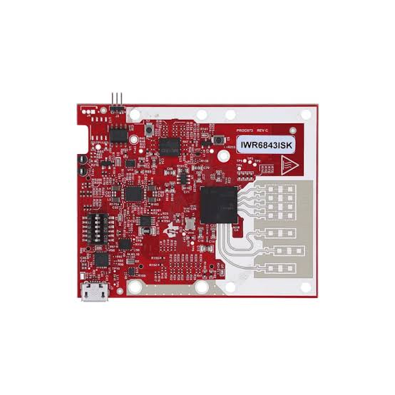

# Halo: Non-Contact Edge mmWave Fall Detector for Elder Care

Halo is a privacy-first, non-contact monitoring system designed for elder care facilities and private homes. By leveraging high-frequency mmWave radar technology, it provides highly accurate fall detection, presence tracking, and vital signs monitoring without the use of invasive cameras or wearable devices. 

This repository contains the hardware integration, edge-processing logic, and machine learning models required to run the Halo system locally on edge devices.

## 🌟 Key Features

*   **Privacy-First Design:** Complete absence of optical cameras; only abstract point cloud data and bounding boxes are processed.
*   **Edge Computing:** No constant cloud uplink required for detection—minimizes latency and removes privacy concerns related to raw data transmission.
*   **Vital Signs Monitoring:** Real-time heart rate and breathing rate extraction computed directly on the radar chip.
*   **Robust Fall Detection:** Utilizes a PyTorch-based neural network trained on point cloud dynamics to classify activities and detect falls.

---

## 🏗️ System Architecture

The Halo system architecture is distributed across three primary compute tiers: the Radar Sensor, the Real-Time Coprocessor, and the Linux Application MPU.


### 1. Hardware Stack

*   **Texas Instruments IWR6843ISK:** A 60-GHz to 64-GHz mmWave sensor. Flashed with the Vital Signs + Tracking firmware from the TI Radar Toolbox.
*   **mmWaveICBoost Carrier:** Provides standard interfaces, debugging capabilities, and bridges the high-speed telemetry to the coprocessor.
*   **Arduino UNO Q (STM32 MCU):** Acts as the real-time telemetry ingester and parser.

---

## 📡 Data Pipeline & Telemetry

The TI radar streams a highly condensed raw binary telemetry output. The STM32 microcontroller is responsible for parsing this real-time stream into actionable structural data.

### The Parsing Engine

The telemetry is formatted using Type-Length-Value (TLV) packets. The MCU implements a custom parser based on `parseTLVs.py` specifications to decode three primary structs:

1.  **Point Cloud (Type 1):** Returns the 3D spatial points $(X, Y, Z)$ and Doppler velocity of moving subjects.
2.  **Target List (Type 1010):** Returns the tracked targets, handled by the IWR6843's on-chip grouping and tracking algorithms.
3.  **Vitals (Type 1040):** Returns pre-calculated, filtered heart rate and respiration rate values.


### Spatial Filtering and Defensive Bounds

Because edge MPUs have limited resources, the MCU implements physical world constraints *before* passing data upstream:
*   **Bounding-Box Pruning:** Points that fall outside the defined physical room bounds are instantly dropped to prevent ghosting or processing artifacts.
*   **Sanity Caps:** The parser strictly enforces maximum points per TLV, maximum TLVs per frame, and absolute packet-length sanity to prevent buffer overruns or segmentation faults in the Linux MPU.

---

## 🧠 Linux Application MPU Architecture

The downstream Linux application (implemented in Python) acts as the brain of the edge device. To ensure real-time latency, it uses a 4-Thread architecture.


### Thread Breakdown

*   **Thread 1: Spatial Engine:** Consumes the `radar_targets` channel. Uses the pre-tracked target lists from the TI chip, or performs custom DBSCAN/K-Means clustering on the `radar_pointcloud` if the on-chip tracker loses confidence.
*   **Thread 2: Activity Classifier:** Consumes the `radar_pointcloud` channel. Aggregates data into a rolling-window time-series tensor. This tensor is fed into the PyTorch Neural Network (`fall_model.pth`) to classify activities and trigger Fall Detection alerts.
*   **Thread 3: Vitals Consumer:** Consumes the `radar_vitals` channel. The phase-shift algorithms run on the TI radar, so this thread is purely responsible for smoothing, formatting, and thresholding critical heart and breath rate deviations.
*   **Thread 4: Router & Dashboard:** The event aggregator and transport layer. Publishes the serialized events (falls, vital spikes, presence) to a local dashboard or an external MQTT/HTTP server.

---

## 📂 Repository Structure

The project has been refactored into a highly modular directory structure:

```text
├── docs/
│   └── diagrams/             # High-resolution Mermaid diagrams
├── model_training/
│   ├── data/                 # Raw datasets and pointcloud captures
│   └── notebooks/            # Jupyter notebooks (e.g., FallDetection.ipynb)
└── src/
    ├── mcu_arduino/          # STM32 / Arduino UNO Q parser sketch
    └── mpu_linux/            # The 4-Thread Python backend application
```

## ⚙️ Model Training & AI

The Fall Detection model is a PyTorch-based sequence classifier (`MyCNN`).

### PyTorch Tensor Specifics
The model expects a 4D input tensor formatted from the accumulated point cloud data:
*   **Shape:** `(Batch_Size, Frames, Max_Objects, 4)`
*   **Features (4):** Each tracked point contains `(X, Y, Z, Doppler_Velocity)`.
*   During inference, the rolling-window tensor is gathered, padded to the maximum detected objects per frame, and passed to `fall_model.pth` to yield a binary Fall/Not-Fall prediction.

*   **Notebook:** Located at `model_training/notebooks/FallDetection_root.ipynb`.
*   **Weights:** The production weights are saved as `src/mpu_linux/fall_model.pth`.
*   **Data:** Training datasets are stored in `model_training/data/GatheredData`.

## 🚀 Setup and Deployment

### 1. Arduino MCU Setup & Wiring


**Hardware Connections (Arduino UNO Q to IWR6843ISK / mmWaveICBoost):**
*   **Power & Ground:**
    *   **UNO Q GND** $\rightarrow$ **Header J5 Pin 4 (GND)** (Mandatory common ground reference for UART signal integrity).
    *   *Note:* The mmWaveICBoost should use its dedicated 5V power source, isolated from the Arduino power logic.
*   **Configuration UART (115200 baud):**
    *   **UNO Q D0 (USART1_RX)** $\rightarrow$ **Header J5 Pin 3 (RS232TX)**: Transmits data from the radar out to the Arduino's MCU receive pin.
    *   **UNO Q D1 (USART1_TX)** $\rightarrow$ **Header J5 Pin 5 (RS232RX)**: Transmits configuration and commands from the Arduino out to the radar's receive pin.
*   **High-Speed Data UART (921600 baud):**
    *   **UNO Q RX (Hardware Serial)** $\rightarrow$ **Header J6 Pin 9 (Data TX)**: Dedicated telemetry stream for high-throughput TLV packets (Type 1010 targets, Type 1 point cloud, and Type 1040 vitals).

**Flashing the Arduino:**
1. Open `src/mcu_arduino/sketch.ino` in the Arduino IDE.
2. Select your STM32 / Arduino UNO Q board configuration.
3. Flash the firmware to enable the TLV parser and bridge channels.

### 2. Linux MPU Setup
1. Navigate to the Python application directory:
   ```bash
   cd src/mpu_linux
   ```
2. Install the required dependencies:
   ```bash
   pip install -r requirements.txt
   ```
3. Run the main multi-threaded application:
   ```bash
   python main.py
   ```

*(Ensure the Arduino is connected via USB/Serial and the port is correctly mapped in `main.py`).*

## Hardware Setup & Radar Configuration




This project requires a Texas Instruments **IWR6843ISK** mmWave Radar mounted on the **MMWAVEICBOOST** carrier board for connecting via UART and other communication interfaces. We utilize the "Vital Signs with People Tracking" firmware to extract raw point cloud data, tracker target lists, and vital signs in a single unified data stream.

### 1. Prerequisites & Downloads
Before starting, ensure you have the following downloaded and installed:
1. **TI Radar Toolbox**: Download `radar_toolbox_3_30_00_06` (or the latest) from the [TI Resource Explorer](https://dev.ti.com/tirex/explore/node?node=A__AEIJm0rwIeU.2P1OBWwlaA__radar_toolbox__1AslXXD__LATEST). Extract this to your `C:\ti\` folder.
2. **TI UniFlash**: Download and install [UniFlash](https://www.ti.com/tool/UNIFLASH) to write the firmware to the radar.
3. **XDS110 Drivers**: Because you are using the MMWAVEICBOOST, you need the TI XDS110 drivers (these are usually installed automatically when you install UniFlash).

### 2. Flashing the Firmware
The radar must be flashed with the pre-built binary included in the TI Toolbox.

1. **Set to Flashing Mode**: On the MMWAVEICBOOST board, locate the **S1** switch bank (labeled SOP0, SOP1, SOP2). Set them to Flashing Mode:
   * **SOP0:** ON
   * **SOP1:** OFF
   * **SOP2:** ON
2. **Connect to PC**:
   * Connect a 5V/3A barrel jack power supply to the ICBOOST.
   * Plug a Micro-USB cable into the **XDS110 USB port** on the ICBOOST board *(Do not plug into the USB port on the green ISK antenna board)*.
3. **Open UniFlash**:
   * Select your device as `IWR6843ISK`.
   * Go to Settings and enter the COM port number for your **Application/User UART** (find this in Windows Device Manager).
4. **Select Binary**: Navigate to the Program tab. For Meta Image 1, browse to your TI folder and select the binary:
   * `C:\ti\radar_toolbox_3_30_00_06\radar_toolbox_3_30_00_06\source\ti\examples\Industrial_and_Personal_Electronics\Vital_Signs\Vital_Signs_With_People_Tracking\prebuilt_binaries\vital_signs_tracking_6843ISK_demo.bin`
5. **Flash**: Click `Load Image`. Wait for the "Success" message at the bottom of the screen.
6. **Set to Functional Mode**: Disconnect the 5V power, flip the SOP switches back to Functional Mode, and plug the power back in:
   * **SOP0:** ON
   * **SOP1:** OFF
   * **SOP2:** OFF

### 3. Understanding the COM Ports
When plugged into the XDS110 USB port, the MMWAVEICBOOST enumerates as two separate COM ports in your Windows Device Manager under "Ports (COM & LPT)":
* **XDS110 Class Application/User UART (CFG_PORT):** Operates at `115200` baud. Used to send the `.cfg` file text commands to the radar to start the sensor.
* **XDS110 Class Auxiliary Data Port (DATA_PORT):** Operates at `921600` baud. Used by the radar to blast the binary TLV (Type-Length-Value) packets containing the point cloud, tracker, and vital signs data back to the PC.

### 4. Configuring and Getting Data
To tell the radar to start broadcasting data, you must send it a configuration file over the CFG_PORT.

**The Config File:**
We use the `vital_signs_ISK_6m.cfg` file, located here:
`C:\ti\radar_toolbox_3_30_00_06\radar_toolbox_3_30_00_06\source\ti\examples\Industrial_and_Personal_Electronics\Vital_Signs\Vital_Signs_With_People_Tracking\chirp_configs\`

**Starting the Data Stream:**
You have two options to send this config and view the data:

* **Option A (GUI Visualizer):**
  Run the Industrial Visualizer executable located in the radar toolbox at `\tools\visualizers\Industrial_Visualizer`. Select the correct XDS110 COM ports, select the "Vital Signs with People Tracking" lab, load the `vital_signs_ISK_6m.cfg` file, and click Start.
* **Option B (Python Script):**
  When running our custom Python data collection script, you will specify the COM port numbers and the path to `vital_signs_ISK_6m.cfg`. The script opens the CFG_PORT (Application/User UART), reads the `.cfg` file line-by-line, and sends it to the radar. Immediately after, it opens the DATA_PORT (Auxiliary Data Port) to capture the incoming point cloud and vital signs streams for ML processing.

---
*Developed for elder care environments demanding the highest degree of privacy, dignity, and reliability.*
